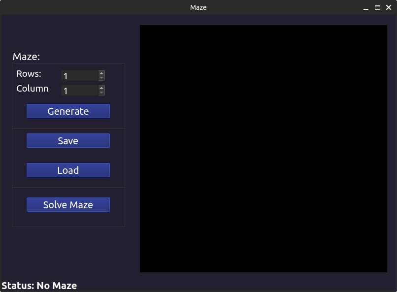
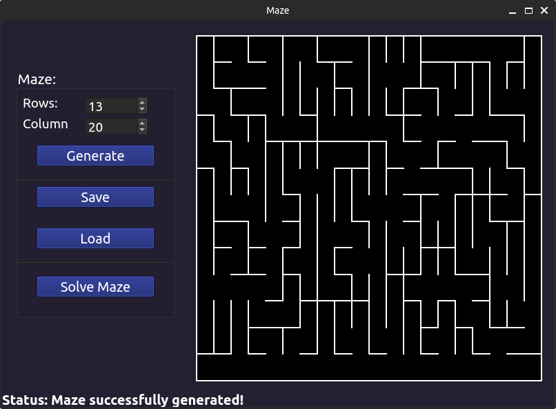
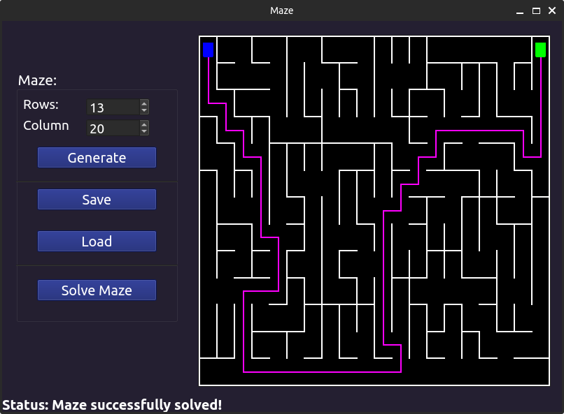

# Maze by tomokoki and bruscoaz <!-- omit in toc -->

Приложение для генерации, загрузки из файла лабиринта, его сохранения в файл, нахождения кратчайшего пути между любыми двумя его точками. Программа написана на языке __C++__ с использованием графической библиотеки __QT__.

## Contents <!-- omit in toc -->
- [Information:](#information)
- [Installation:](#installation)
- [Options:](#options)
- [Examples](#examples)

## Information:

В данном проекте была разработана программа Maze, позволяющая генерировать, отрисовывать идеальные лабиринты. 
Список алгоритмов, использованных в проекте:
- __Алгоритм Эйлера__ для генерации идеальных лабиринтов;
- __Волновой алгоритм__ для нахождения кратчайшего пути между двумя точками

__Формат файла с лабиринтом:__
```
4 4 
0 0 0 1
1 0 1 1
0 1 0 1
0 0 0 1

1 0 1 0
0 0 1 0
1 1 0 1
1 1 1 1
```


## Installation:

- Для установки вам необходимо перейти в дирректорию __src__ и в терминале выполнить команду `make install`. Приложение будет установленно в паку __build__, которая находится также в папке __src__;
- Чтобы выполнить деинтсаляцию - выполните команду `make uninstall`;
- Для формирования __tgz архива__ -  выполните команду `make dist`. Сформированный файл будет находиться в папке __dist__;
- Для просмотра документации _(данного файла)_ - выполните команду `make dvi`; 
- Для запуска тестов необходимо в терминале выполнить команду `make tests`;
- Чтобы посмотреть покрытие кода - выполните команду `make gcov_report`;


## Options:

Основы работы с приложением:
- Вы можете загрузить лабиринт из файла. Для этого нажмите на кнопку __Load__ и выберите файл в формате `txt`. (_Важно: данные в файле должны быть строго в формате, указнном выше_);
- Также вы можете сгенерировать идеальный лабиринт. Для этого задайте размер лабиринта и нажмите на кнопку __Generate__;
- Любой лабиринт можно сохранить в файл. Для этого нажмите на __Save__ и введите название для файла;
- Для __решения лабиринта__ нужно:
  - `Левой кнопкой мыши` задать стартовую точку;
  - `Правой кнопкой мыши` задать конечную точку;
  - Нажать на кнопку __Solve Maze__; 

## Examples

Начальный интерфейс:


Открытый лабиринт:


Построенный маршрут:


